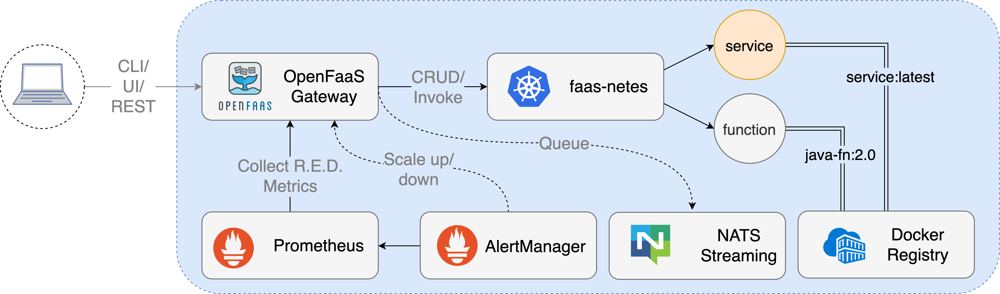

cold start time
hot start time
gpu support?
arm support?
snap start?
couts d'ingress hyper chers lambda
deploiement sur openshift
connection db extérieure

# Use case 1 : API

- Easy to deploy
- Docker integration
- Cold start time
- Connection to other OpenFaaS service
- Existing template
- Cost

# Use case 2 : Render farm

- Custom Dockerfile
- Cronjob
- Monitoring performance
- Scalable
- Error handling
- GPU ?
- Configuration of resources
- Cost

plateformes self service wavestone : joseph deriaux
nodepool gpu
qu est ce qui spawn
hpa?
kubetl get all voir ce qui spawn

faire schema spawn pour rendu
schema darchi

---

openshift = predefined kubernetes easier but more rigid

faas-netes is the bridge between openfaas and kubernetes, it translates openfaas function deployments into kubernetes resources (services, deployments, ...), communicates with kube's Horizontal Pod Autoscaler to manage function replicas

NATS streaming handles requests while functions are being loaded to allow returning an "accepted" response instantly and processing when available

---

fonctionnalite
cout

config par rapport a lambda
comp cout aks

securite
bonnes pratiques integrees?

scanner vuln, patchs vitesse

grip trivi
est ce quils sont proactifs sur les fix

quest ce quoin peut automatiser
comment on peut mettre a dispo d'autres equipes

cas d'usage gros workload

facile de faire les deux docker const et faas

estimation cout d'usages

support
contexte
cas dusge
resultate
proj diff cout fonction secu
implementation ideale recommandee

GKE manual
hey -z=10m http://34.55.252.22:8080/function/render-front
^L^[l
Summary:
  Total:	600.1047 secs
  Slowest:	3.8797 secs
  Fastest:	0.1034 secs
  Average:	0.1169 secs
  Requests/sec:	427.5304

Response time histogram:
  0.103 [1]	|
  0.481 [256039]	|■■■■■■■■■■■■■■■■■■■■■■■■■■■■■■■■■■■■■■■■
  0.859 [375]	|
  1.236 [136]	|
  1.614 [3]	|
  1.992 [8]	|
  2.369 [0]	|
  2.747 [0]	|
  3.124 [0]	|
  3.502 [0]	|
  3.880 [1]	|

Latency distribution:
  10% in 0.1055 secs
  25% in 0.1071 secs
  50% in 0.1102 secs
  75% in 0.1162 secs
  90% in 0.1278 secs
  95% in 0.1438 secs
  99% in 0.2100 secs

Details (average, fastest, slowest):
  DNS+dialup:	0.0000 secs, 0.1034 secs, 3.8797 secs
  DNS-lookup:	0.0000 secs, 0.0000 secs, 0.0000 secs
  req write:	0.0000 secs, 0.0000 secs, 0.0011 secs
  resp wait:	0.1132 secs, 0.1026 secs, 3.8726 secs
  resp read:	0.0036 secs, 0.0000 secs, 1.0554 secs

Status code distribution:
  [200]	256563 responses

---

Cloud Run
hey -z=10m https://render-front-957318179787.europe-west1.run.app/

Summary:
  Total:	600.0241 secs
  Slowest:	4.6687 secs
  Fastest:	0.0144 secs
  Average:	0.0300 secs
  Requests/sec:	1692.0921

Response time histogram:
  0.014 [1]	|
  0.480 [999856]	|■■■■■■■■■■■■■■■■■■■■■■■■■■■■■■■■■■■■■■■■
  0.945 [99]	|
  1.411 [26]	|
  1.876 [12]	|
  2.342 [0]	|
  2.807 [0]	|
  3.272 [0]	|
  3.738 [4]	|
  4.203 [0]	|
  4.669 [2]	|

Latency distribution:
  10% in 0.0217 secs
  25% in 0.0241 secs
  50% in 0.0275 secs
  75% in 0.0318 secs
  90% in 0.0375 secs
  95% in 0.0430 secs
  99% in 0.0650 secs

Details (average, fastest, slowest):
  DNS+dialup:	0.0000 secs, 0.0144 secs, 4.6687 secs
  DNS-lookup:	0.0000 secs, 0.0000 secs, 0.0184 secs
  req write:	0.0000 secs, 0.0000 secs, 0.0059 secs
  resp wait:	0.0291 secs, 0.0135 secs, 4.6266 secs
  resp read:	0.0008 secs, 0.0000 secs, 1.5511 secs

Status code distribution:
  [200]	999962 responses
  [500]	38 responses

---

GKE auto
hey -z=10m http://34.133.127.51:8080/function/render-front

Summary:
  Total:	600.1020 secs
  Slowest:	1.7990 secs
  Fastest:	0.1037 secs
  Average:	0.1146 secs
  Requests/sec:	436.3625

Response time histogram:
  0.104 [1]	|
  0.273 [261417]	|■■■■■■■■■■■■■■■■■■■■■■■■■■■■■■■■■■■■■■■■
  0.443 [169]	|
  0.612 [21]	|
  0.782 [108]	|
  0.951 [51]	|
  1.121 [23]	|
  1.290 [25]	|
  1.460 [7]	|
  1.629 [0]	|
  1.799 [40]	|

Latency distribution:
  10% in 0.1068 secs
  25% in 0.1083 secs
  50% in 0.1107 secs
  75% in 0.1147 secs
  90% in 0.1210 secs
  95% in 0.1269 secs
  99% in 0.1861 secs

Details (average, fastest, slowest):
  DNS+dialup:	0.0000 secs, 0.1037 secs, 1.7990 secs
  DNS-lookup:	0.0000 secs, 0.0000 secs, 0.0000 secs
  req write:	0.0000 secs, 0.0000 secs, 0.0014 secs
  resp wait:	0.1130 secs, 0.1032 secs, 1.3420 secs
  resp read:	0.0014 secs, 0.0000 secs, 1.3370 secs

Status code distribution:
  [200]	261862 responses

Mercredi : Render full
Jeudi : Front full
Vendredi : Render mid
